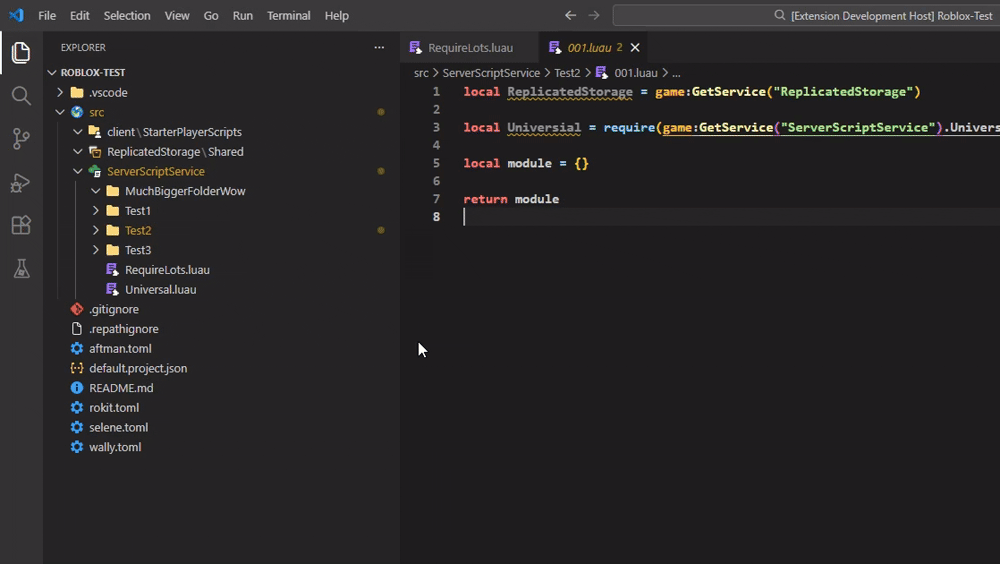
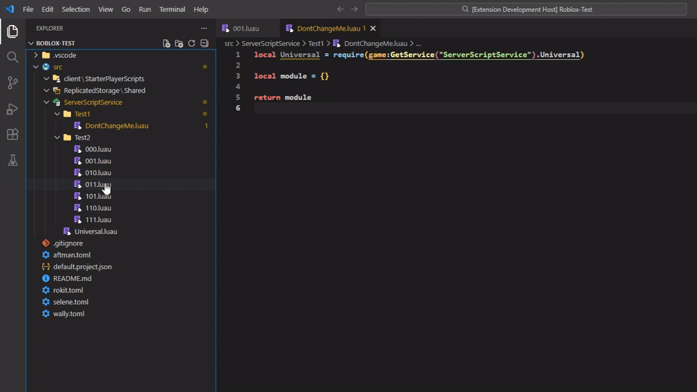

# RePath


RePath is an Extension that watches your Explorer. 
When you move a ModuleScript to a new location, 
RePath automatically scans your scripts and updates the paths in your code to match the new location!

# Features
- **Automatic Path Detection:** Fires when a script is parented to a new location
- **Updates quickly:** Updates `require()` paths in existing scripts quickly
- **Refactoring Friendly:** Ideal for large scale projects where you need to change your code structure without breaking the game logic

### Automatic Variable Service Detection

Variables containing Services (`local Service = game:GetService()`) get included on the update (When changing the location of any script):
From `local module = require(game:GetService().path)` to `local module = require(Service.path)`

If there's no variable, then it will require the module directly with `game:GetService()`

### .repathignore

A file for excluding directories where you don't want to have things changed. 
Useful for big packages. <br>
Use the **command bar** from VS Code to create a blank .repathignore file!

### Multiple Files at once + Paths without require()


You can also move Folders around and every script requiring the scripts inside that folder <br>
Will get their path changed. Multiple Folders and Scripts can be moved as well!

Paths without require() will also change 

## Notes & Feedback
I created this Extension to make code organization less punishing. Whether you’re doing a massive system refactor or just cleaning up a few folders, RePath saves you time.

Please let me know if you encounter any bugs or have any feature requests!

## Requirements
Needs Rojo with its `default.package.json` file.

## Warning
The repathing doesn't work on multiple nested variables:

```luau
local Service = game:GetService("ServerScriptService")
local SubPath = Service.sub.path

local module = require(Service.SubPath.more.path)
```


